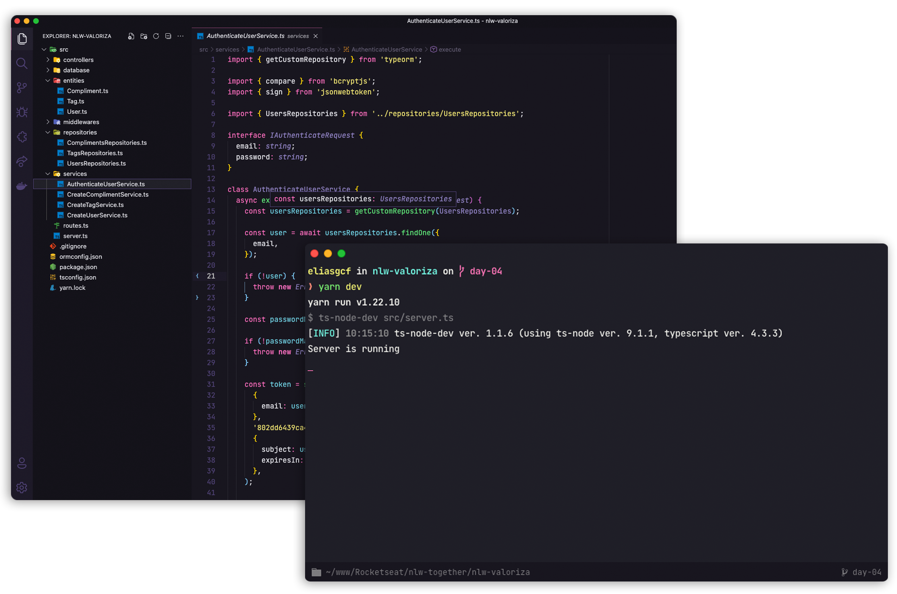

<h1 align="center">Valoriza</h1>

  

  

  

## ✨ Tecnologias

Esse projeto foi desenvolvido com as seguintes tecnologias:

- [Node.js](https://nodejs.org/en/)
- [Typescript](https://www.typescriptlang.org/)
- [Express](https://expressjs.com/pt-br/)
- [JSONWebToken](https://github.com/auth0/node-jsonwebtoken#readme)
- [Docker](https://www.docker.com/)
- [PostgresSQL](https://www.postgresql.org/)

## 💻 Projeto

Valoriza é uma plataforma para promover o reconhecimento entre companheiros de equipe.
Este projeto foi desenvolvido durante a NLW-06, que é um evento promovido gratuitamente pela RocketSeat com o objetivo de desenvolver um projeto completo em uma semana ensinando tecnologias do ecossistema JavaScript.

## 🚀 Como executar

- Clone o repositório
- Rode `yarn` para baixar as dependências
- Rode `docker-compose up` para subir o container do banco de dados
- Aguarde o container estar de pé e então rode  `yarn typeorm migration:run` em um novo terminal para criar as tabelas do banco de dados.
- Rode o `yarn dev` para iniciar a aplicação.

Por fim, a aplicação estará disponível em `http://localhost:3000`

## 📄 Licença

Esse projeto está sob a licença MIT. Veja o arquivo [LICENSE](LICENSE.md) para mais detalhes.

---
Feito com 💜 &nbsp;by Thiago Ramos with Rocketseat 👋🏻 &nbsp;
